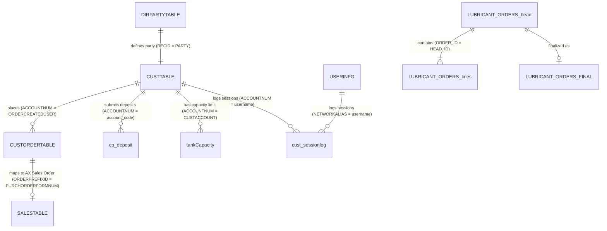

# Functional Audit & Migration Specification Document

**Target Application:** Legacy PHP Customer Portal (`CustomerPortal_Live`)  
**Document Status:** Complete Architecture & Functional Audit  
**Author:** Senior Migration Architect  
**Date:** September 15, 2026  

---

## Executive Summary

This document provides a comprehensive functional and technical audit of the legacy PHP codebase located in `./CustomerPortal_Live`. It serves as the authoritative migration specification for re-platforming the legacy PHP application to a modern framework (e.g., .NET / C# ASP.NET Core MVC).

The legacy codebase is a web portal for **Taj Gasoline**, managing fuel and lubricant ordering, customer balance tracking, credit limit checks, order approvals, deposit slip uploads, proforma invoice management, and reporting. It interfaces directly with **Microsoft Dynamics AX** database (`TAJ_DynamicsAX`) as well as auxiliary local MySQL databases (`dbCharityFinance`).

> [!IMPORTANT]
> **Migration Policy Directive:** No C# or .NET code is included in this document. This specification details all legacy behavior, schemas, routes, sessions, security models, and third-party dependencies required to execute an accurate, high-fidelity migration.

---

## 1. Routes, Endpoints, URL Query Parameters, and HTTP Methods

The legacy PHP application uses standard file-based routing. Below is the complete catalog of all accessible routes and endpoints, organized by subsystem.

### 1.1 Authentication & Core Session Endpoints

| Route / File Path | HTTP Method | Input Parameters (GET / POST) | Security Gate | Response Type | Description / Business Purpose |
| :--- | :--- | :--- | :--- | :--- | :--- |
| `pages/login.php` | GET, POST | **POST:** `userid`, `password`, `checkUser`, `submit` | Public | HTML / Redirect | Primary authentication portal for both Admins (`userinfo`) and Customers (`CUSTTABLE`). Sets session variables and redirects based on role. |
| `pages/logout.php` | GET | None | Authenticated | Redirect (`login.php`) | Destroys PHP session via `session_unset()` and `session_destroy()`, redirecting user to login page. |
| `pages/sessionLog.php` | Internal Include | Uses `$_SESSION['userid']` | Internal | Script / DB Action | Included upon successful login. Increments session ID counter in `cust_sessionlog` table and logs client IP (`REMOTE_ADDR`) and login timestamp. |
| `pages/sessionLogOut.php` | Internal Include | Uses `$_SESSION['sessionid']` | Internal | Script / DB Action | Updates `cust_sessionlog` with logout timestamp (`timeout = GETDATE()`). |
| `pages/Maintenance.php` | GET | None | Public | HTML | Maintenance mode landing page (can be toggled via `login.php` header redirect). |

---

### 1.2 Customer Portal Endpoints

| Route / File Path | HTTP Method | Input Parameters | Security Gate | Response Type | Description / Business Purpose |
| :--- | :--- | :--- | :--- | :--- | :--- |
| `pages/home.php` | GET | None | Customer (`userRole == 0`) | HTML | Customer dashboard displaying summary metrics (Total Orders, Pending Orders, Invoiced Orders, Holds Free Balance, Credit Limit, Balance). |
| `pages/orderNow.php` | GET, POST | **POST:** `productCode`, `productName`, `newOrderQuantity`, `site`, `submit` | Customer (`userRole == 0`) | HTML / JS Alert | Core order placement interface. Validates tank capacity, credit limit, and dealer rates before inserting record into `CUSTORDERTABLE`. |
| `pages/openOrder.php` | GET | None | Customer (`userRole == 0`) | HTML | Displays list of active open orders placed by the logged-in customer. |
| `pages/openorderdetail.php` | GET | **GET:** `op` (Order Prefix ID) | Customer (`userRole == 0`) | HTML | Detailed breakdown of a specific open order. |
| `pages/invoicedOrder.php` | GET | None | Customer (`userRole == 0`) | HTML | Displays historical orders that have been invoiced. |
| `pages/invoiceorderdetail.php` | GET | **GET:** `op` (Order Prefix ID) | Customer (`userRole == 0`) | HTML | Detailed invoice breakdown for a specific order prefix. |
| `pages/completedPurchOrders.php` | GET | None | Customer (`userRole == 0`) | HTML | Completed purchase order summary view. |
| `pages/orderdetail.php` | GET | **GET:** `op` (Order Prefix ID) | Customer (`userRole == 0`) | HTML | Detailed order status, release history, and item quantities. |
| `pages/pendingOrders.php` | GET | None | Customer (`userRole == 0`) | HTML | Displays orders with pending quantity awaiting full allocation or release. |
| `pages/pendingOrderDetails.php` | GET | **GET:** `op` (Order Prefix ID) | Customer (`userRole == 0`) | HTML | Detail view for pending order quantities. |
| `pages/customerPayments.php` | GET | None | Customer (`userRole == 0`) | HTML | Displays customer payment records, ledger credits, and deposit slip submission status. |
| `pages/customerDeposit.php` | GET, POST | **POST:** `amount`, `bank`, `ds_date`, `description`, `dsUpload` (File) | Customer (`userRole == 0`) | HTML / SweetAlert | Form for submitting bank deposit slips. Uploads file to `images/ds/` and inserts into `cp_deposit` table. |
| `pages/customertransaction.php` | GET | None | Customer (`userRole == 0`) | HTML | Financial transaction history report for the logged-in customer. |
| `pages/ledgerReport.php` | GET | None | Customer (`userRole == 0`) | HTML | Customer account ledger report displaying debits, credits, and running balance. |
| `pages/hfBalanceDetails.php` | GET | None | Customer (`userRole == 0`) | HTML | Detailed breakdown of Holds-Free (HF) balance across products. |
| `pages/mholdsfree.php` | GET | None | Customer (`userRole == 0`) | HTML | Manual holds-free management and display view. |
| `pages/orderStatus.php` | GET | None | Customer (`userRole == 0`) | HTML | Overall status grid of customer orders. |
| `pages/changepassword.php` | GET, POST | **POST:** `oldPassword`, `newPassword`, `confirmPassword` | Authenticated | HTML / SweetAlert | Interface for updating customer account password. |
| `pages/TL.php` | GET | None | Authenticated | HTML | Tank Lorry carrier selection and tracking interface. |
| `pages/TrainingVideos.php` | GET | None | Authenticated | HTML | Embedded video resources for user onboarding. |

---

### 1.3 Admin Portal Endpoints

| Route / File Path | HTTP Method | Input Parameters | Security Gate | Response Type | Description / Business Purpose |
| :--- | :--- | :--- | :--- | :--- | :--- |
| `pages/admin.php` | GET | None | Admin (`userRole == 1`) | HTML | Main administrator dashboard showing all customer order requests awaiting approval or release. |
| `pages/adminApprove.php` | GET, POST | **GET:** `op` (Order Prefix), `cust` (Customer ID) | Admin (`userRole == 1`) | HTML / SweetAlert | Admin order approval screen. Allows setting released quantity, holds-free allocation, and updating order flags. |
| `pages/admin_customerOrders.php` | GET | None | Admin (`userRole == 1`) | HTML | Full list of customer orders with filtering and search capabilities. |
| `pages/admin_mergeOrders.php` | GET | None | Admin (`userRole == 1`) | HTML | Interface for administrators to combine multiple partial customer orders into a single consolidated order. |
| `pages/admin_cancelOrders.php` | GET | None | Admin (`userRole == 1`) | HTML | View of customer orders that have been cancelled. |
| `pages/admin_revertOrders.php` | GET | None | Admin (`userRole == 1`) | HTML | Allows admins to revert a released or approved order back to pending/holds-free status. |
| `pages/adminUploadProforma.php` | GET, POST | **GET:** `op`, `cust`<br>**POST:** `dsUpload` (File), `submit` | Admin (`userRole == 1`) | HTML / SweetAlert | Uploads proforma invoice files (PDF/images) to `images/proforma/` and updates `prof_upload_flag` in `CUSTORDERTABLE`. |
| `pages/adminTLedit.php` | GET, POST | **GET:** `op`, `cust`<br>**POST:** `tlCode`, `editTL` | Admin (`userRole == 1`) | HTML | Interface to edit or update Tank Lorry details associated with an order. |
| `pages/adminLubeSubmittedOrders.php` | GET | None | Admin (`userRole == 1`) | HTML | Overview of submitted lubricant orders in the admin panel. |
| `pages/admin_lubeUploadedOrders.php` | GET | None | Admin (`userRole == 1`) | HTML | Master header list of uploaded lubricant orders. |
| `pages/admin_lubeUploadedOrdersLines.php` | GET | None | Admin (`userRole == 1`) | HTML | Line-item detail of uploaded lubricant orders. |
| `pages/admin_lubeCancelledOrders.php` | GET | None | Admin (`userRole == 1`) | HTML | Cancelled lubricant orders list for administration. |

---

### 1.4 Action Handlers (Backend API Controllers)

| Route / File Path | HTTP Method | Input Parameters | Security Gate | Response Type | Description / Business Purpose |
| :--- | :--- | :--- | :--- | :--- | :--- |
| `pages/actionAdminTransaction.php` | POST | `orderPrefix`, `releaseQty`, `bl` | Admin (`userRole == 1`) | Redirect / Script | Processes admin order release logic. Splits order if release quantity < order quantity, updates `HOLDSFREEBALANCE`, and creates child orders. |
| `pages/actionAdminTransaction2.php` | POST | `orderPrefix`, `hfQty` | Admin (`userRole == 1`) | Redirect / Script | Updates holds-free quantity (`HOLDFREEQTY`) for a specific order prefix. |
| `pages/actionCancelOrder.php` | GET | `order` | Authenticated | Redirect / Script | Sets `CANCEL_FLAG = 1` and `CANCELDATETIME = GETDATE()` in `CUSTORDERTABLE` for the specified order prefix. |
| `pages/actionCancelOrder2.php` | GET | `order` | Authenticated | Redirect / Script | Secondary cancel handler for specific order prefix workflows. |
| `pages/actionChangePassword.php` | POST | `oldPassword`, `newPassword`, `confirmPassword` | Authenticated | JSON / Script | Executes `CUSTTABLE` password update query after validating old password match. |
| `pages/actionCredit.php` | POST | `orderPrefix`, `creditAmt` | Admin (`userRole == 1`) | Script | Processes credit updates associated with an order. |
| `pages/actionDynRelease.php` | POST | `orderPrefix`, `relQty` | Admin (`userRole == 1`) | Script | Calculates site tank capacity limits against `tankCapacity` table before triggering order release. |
| `pages/actionHfRemQty.php` | POST | `customerId`, `productCode` | Authenticated | JSON | Queries sum of remaining holds-free balance (`SUM(HOLDSFREEBALANCE)`) for a customer and product. |
| `pages/actionMergeOrders.php` | POST | `order1`, `order2`, `mergedQty` | Admin (`userRole == 1`) | Redirect / Script | Merges two separate orders into a new single record, resetting pending and partial flags on original records. |
| `pages/actionNewRecord.php` | POST | `pre`, `orderQty`, `productCode` | Authenticated | Redirect / Script | Inserts new child order record linked to parent order prefix when partial releases occur. |
| `pages/actionOrder.php` | POST | `orderData` | Authenticated | JSON | Helper endpoint for retrieving order entity details. |
| `pages/actionPaymentsClear.php` | POST | `paymentId` | Admin (`userRole == 1`) | Script | Marks payment record as cleared. |
| `pages/actionPendingQty.php` | POST | `customerId`, `productCode` | Authenticated | JSON | Calculates total pending quantity (`SUM(PENDING_QTY)`) for customer and product. |
| `pages/actionReceivedOrder.php` | GET | `order` | Authenticated | Script | Sets `RECEIVED_FLAG = 1` and `RECEIVEDDATETIME = GETDATE()` when customer confirms receipt of order delivery. |
| `pages/actionRevertOrder.php` | POST | `orderPrefix`, `releaseQty` | Admin (`userRole == 1`) | Script | Reverts released order back to holds-free status (`HOLDSFREE_FLAG = 1`, `RELEASED_FLAG = 0`). |
| `pages/actionAdminCancelLubeOrders.php` | POST/GET | `id` | Admin (`userRole == 1`) | Script | Cancels lubricant order in `LUBRICANT_ORDERS_FINAL` (`CANCEL_FLAG = 1`, `STATUS_FLAG = 2`). |
| `pages/actionAdminEditLubeOrders.php` | POST | `id`, `qty`, `rate` | Admin (`userRole == 1`) | Script | Edits quantities and line totals in `LUBRICANT_ORDERS_final` and `LUBRICANT_ORDERS_head`. |
| `pages/actionAdminLubeStatusUpdate.php` | POST/GET | `id` | Admin (`userRole == 1`) | Script | Updates lubricant order status to uploaded (`STATUS_FLAG = 1`, `ORDERSTATUS = 'UPLOADED'`). |

---

### 1.5 Server-Side DataTables API Endpoints (`New` & `New33` Subdirectories)

| Route / File Path | HTTP Method | Input Parameters | Security Gate | Response Type | Description / Business Purpose |
| :--- | :--- | :--- | :--- | :--- | :--- |
| `pages/New/AdminOrders.php` | GET | DataTables Query Params | Admin (`userRole == 1`) | HTML Wrapper | Modern UI container for Admin Order DataTables. |
| `pages/New/api/TblAdminOrders.php` | GET, POST | `draw`, `start`, `length`, `search[value]` | Admin (`userRole == 1`) | JSON | Server-side DataTables JSON provider fetching admin pending/holds-free orders. |
| `pages/New/api/TblCancelOrders.php` | GET, POST | DataTables Query Params | Admin (`userRole == 1`) | JSON | Server-side DataTables provider for cancelled orders log. |
| `pages/New/api/TblCustomerOrders.php` | GET, POST | DataTables Query Params | Customer (`userRole == 0`) | JSON | Server-side DataTables JSON provider for customer's active orders. |
| `pages/New/api/TblCustomerPayments.php` | GET, POST | DataTables Query Params | Customer (`userRole == 0`) | JSON | Server-side DataTables JSON provider for customer payment records. |
| `pages/New/api/TblMergeOrders.php` | GET, POST | DataTables Query Params | Admin (`userRole == 1`) | JSON | Server-side DataTables JSON provider for order merging candidates. |
| `pages/New/api/TblRevertOrders.php` | GET, POST | DataTables Query Params | Admin (`userRole == 1`) | JSON | Server-side DataTables JSON provider for revertible orders. |
| `pages/New/api/TblScheduledOrders.php` | GET, POST | DataTables Query Params | Authenticated | JSON | Server-side DataTables JSON provider for scheduled delivery orders. |
| `pages/New/api/UpdateScheduledOrders.php` | POST | `orderId`, `scheduleDate` | Authenticated | JSON | Updates delivery schedule timestamp for an order. |
| `pages/New33/api/AddInventory.php` | POST | `itemId`, `siteId`, `qty` | Authenticated | JSON | Inventory insertion endpoint in the New33 module. |
| `pages/New33/api/UpdateInventory.php` | POST | `inventoryId`, `qty` | Authenticated | JSON | Inventory balance update handler. |

---

### 1.6 Lubricants Subsystem Endpoints (`pages/lubricants/`)

| Route / File Path | HTTP Method | Input Parameters | Security Gate | Response Type | Description / Business Purpose |
| :--- | :--- | :--- | :--- | :--- | :--- |
| `pages/lubricants/Home.php` | GET | None | Customer (`lubricantflag == 1`) | HTML | Lubricant customer portal home screen. |
| `pages/lubricants/NewLubeOrder.php` | GET, POST | `brandId`, `productId`, `qty` | Customer (`lubricantflag == 1`) | HTML | Interface for submitting new lubricant product orders. |
| `pages/lubricants/SubmittedOrders.php` | GET | None | Customer (`lubricantflag == 1`) | HTML | Customer view of submitted lubricant orders. |
| `pages/lubricants/UserStockSheet.php` | GET, POST | `siteId`, `stockDate` | Customer (`lubricantflag == 1`) | HTML | Interface for entering customer site lubricant stock balances. |
| `pages/lubricants/UserStockOutSheet.php` | GET, POST | `stockOutData` | Customer (`lubricantflag == 1`) | HTML | Site stock-out / consumption record entry form. |
| `pages/lubricants/api/GetBrands.php` | GET | None | Authenticated | JSON | Returns list of available lubricant product brands. |
| `pages/lubricants/api/getPrice.php` | GET, POST | `productId`, `customerId` | Authenticated | JSON | Fetches pricing for a specific lubricant product item code. |
| `pages/lubricants/api/actionNewLubeOrder.php` | POST | Lube Order Payload | Customer (`lubricantflag == 1`) | JSON | Inserts header into `LUBRICANT_ORDERS_head` and line items into `LUBRICANT_ORDERS_lines`. |
| `pages/lubricants/api/actionFinalOrder.php` | POST | `headId` | Customer (`lubricantflag == 1`) | JSON | Finalizes lubricant order and writes to `LUBRICANT_ORDERS_FINAL`. |
| `pages/lubricants/Admin/Home.php` | GET | None | Admin (`lubricantflag == 2`) | HTML | Admin dashboard for managing corporate lubricant sales and inventory. |
| `pages/lubricants/Admin/LubeSubmittedOrders.php` | GET | None | Admin (`lubricantflag == 2`) | HTML | Admin review screen for customer lubricant orders. |
| `pages/lubricants/Admin/Site_Inventory_Report.php` | GET | `site` | Admin (`lubricantflag == 2`) | HTML | Comprehensive inventory level report across customer sites. |
| `pages/lubricants/Admin/Site_StockOut_Report.php` | GET | `site`, `fromDate`, `toDate` | Admin (`lubricantflag == 2`) | HTML | Lubricant consumption and stock-out analytics report. |

---

### 1.7 Cron Jobs & Automated Background Endpoints

| Route / File Path | HTTP Method | Input Parameters | Execution Context | Response Type | Description / Business Purpose |
| :--- | :--- | :--- | :--- | :--- | :--- |
| `pages/cronGetPdf.php` | CLI / GET | None | Windows Task Scheduler / Cron | Text / File Output | Invokes `wkhtmltopdf` binary via `shell_exec()` to render `cronReport.php` into `pages/cronPdfs/OrderDetails.pdf`. Contains SMTP email sending logic. |
| `pages/cronReport.php` | Internal / GET | None | System / Localhost | HTML | Generates the HTML layout for the daily "ORDERS DUE REPORT", querying orders created within `GETDATE()-1` and `GETDATE()`. |

---

## 2. Session Usage Matrix & Lifecycle Specification

The application manages state through native PHP `$_SESSION` arrays. Below is the complete inventory of every session key used across the codebase, detailing write, read, and destruction locations.

### 2.1 Complete `$_SESSION` Key Inventory

| Session Key Name | Data Type | Written / Initialized In | Read In | Destroyed / Cleared In | Business Purpose & Description |
| :--- | :--- | :--- | :--- | :--- | :--- |
| `$_SESSION['userid']` | String | `pages/login.php` (Lines 75, 108) | `home.php`, `orderNow.php`, `admin.php`, `customerDeposit.php`, `action*.php`, `lubricants/api/*.php` | `logout.php` (`session_destroy()`) | Holds the unique identifier of the authenticated user (`NETWORKALIAS` for admins, `ACCOUNTNUM` for customers). Primary authorization key. |
| `$_SESSION['userRole']` | Integer | `pages/login.php` (Lines 78, 113) | `admin.php`, `adminApprove.php`, `TL.php`, `navbar.php`, `admin_*.php` | `logout.php` | Role flag: `1` = Administrator (access to admin management pages), `0` = Customer (access to ordering portal). |
| `$_SESSION['lubricantflag']` | String / Char | `pages/login.php` (Lines 79, 112, 134) | `home.php`, `navbar.php`, `New/Home.php`, `lubricants/*` | `logout.php` | Subsystem flag: `'0'` = Fuel Customer (TGPL dataareaid), `'1'` = Lubricants Customer (AML dataareaid), `'2'` = Lubricants/Portal Admin. |
| `$_SESSION['customersite']` | String | `pages/login.php` (Line 109) | `home.php`, `orderNow.php`, `customerDeposit.php`, `TrainingVideos.php` | `logout.php` | Customer site name or depot identifier copied from `CUSTTABLE.CustSite`. |
| `$_SESSION['customername']` | String | `pages/login.php` (Line 110) | `home.php`, `navbar.php`, `lubricants/api/NewOrderHead.php` | `logout.php` | Registered business name of the customer entity (copied from `CustSite` / `DIRPARTYTABLE`). |
| `$_SESSION['customercode']` | String | `pages/login.php` (Line 111) | `lubricants/api/NewOrderHead.php`, `home.php` | `logout.php` | Customer account number string (`CUSTTABLE.ACCOUNTNUM`). |
| `$_SESSION['sessionid']` | Integer | `pages/sessionLog.php` (Line 19) | `sessionLogOut.php` (Line 7) | `logout.php` | Primary key identifier of the audit record created in `cust_sessionlog` table upon login. |
| `$_SESSION['Username']` | String | Legacy Headers / `navbar.php` | `navbar.php` | `logout.php` | Display name placeholder for navigation bar headers. |
| `$_SESSION['AdminID']` | String | Legacy Admin Login | `admin.php` | `logout.php` | Legacy administrator user ID reference. |
| `$_SESSION['provider']` | String | `PHPMailer/get_oauth_token.php` (Line 69) | `PHPMailer/get_oauth_token.php` | `get_oauth_token.php` (`unset()`) | Temporary session key storing the OAuth2 provider name during email token acquisition. |
| `$_SESSION['oauth2state']` | String | `PHPMailer/get_oauth_token.php` (Line 126) | `PHPMailer/get_oauth_token.php` | `get_oauth_token.php` (`unset()`) | Anti-CSRF token used during OAuth2 authorization handshakes. |
| `$_SESSION['image']` | String | User Profile Headers | `navbar.php` | `logout.php` | Stores relative URL of user avatar/logo. |
| `$_SESSION['title']` | String | Page Title Handlers | `meta.php` | `logout.php` | Dynamic header page title state. |

---

### 2.2 Session Lifecycle & Inactivity Timeout Mechanism

```
 +------------------------+      +------------------------+      +------------------------+
 |  User Submits Form     | ---> |  login.php Validates   | ---> |  session_start()       |
 |  (pages/login.php)     |      |  Credentials vs DB     |      |  Populates $_SESSION   |
 +------------------------+      +------------------------+      +------------------------+
                                                                             |
                                                                             v
 +------------------------+      +------------------------+      +------------------------+
 |  Client-Side Idle JS   | <--- |  Redirect to Home /    | <--- |  sessionLog.php        |
 |  (session_idle.js)     |      |  Admin Dashboard       |      |  Inserts cust_sessionlog|
 +------------------------+      +------------------------+      +------------------------+
             |
             | Inactivity Timer Triggered (5 mins)
             v
 +------------------------+      +------------------------+
 |  Redirects to          | ---> |  session_unset() &     |
 |  pages/logout.php      |      |  session_destroy()     |
 +------------------------+      +------------------------+
```

1. **Initialization:** Session starts via `session_start()` in `pages/login.php` upon POST submission.
2. **Audit Logging:** Immediately after session keys are populated, `include('sessionLog.php')` executes:
   - Queries `cust_sessionlog` for `MAX(sessionid)`.
   - Obtains client IP via `getenv("REMOTE_ADDR")`.
   - Executes: `INSERT INTO cust_sessionlog(sessionid, timein, ip, username) VALUES ($id, GETDATE(), '$ipaddress', '{$_SESSION['userid']}')`.
   - Stores `$id` in `$_SESSION['sessionid']`.
3. **Client-Side Idle Monitoring (`pages/functions/session_idle.js`):**
   - Included across all page headers.
   - Sets an interval timer checking every 15 seconds (`setInterval(timerIncrement, 15000)`).
   - Listens to `mousemove` and `keypress` events to reset `idleTime = 0`.
   - If `idleTime > 19` (equivalent to 5 minutes of continuous idle time: $20 \times 15\text{s} = 300\text{s}$), it displays a JavaScript `alert('Session Timed out!')` and redirects the browser to `logout.php`.
4. **Termination Flow (`pages/logout.php`):**
   - Calls `session_start()`.
   - (Optional) Executes `include('sessionLogOut.php')`, which updates `cust_sessionlog`:  
     `UPDATE cust_sessionlog SET timeout = GETDATE() WHERE sessionid = {$_SESSION['sessionid']}`.
   - Executes `session_unset()` and `session_destroy()`.
   - Issues an HTTP 302 Redirect to `login.php`.

---

## 3. Authentication, Authorization, & Security Specification

### 3.1 Authentication Architecture & Login Workflow

Authentication is handled in `pages/login.php` via a single form submit that evaluates credentials against two separate SQL Server tables in sequence:

```
                      +-----------------------------+
                      |   POST login.php Submit     |
                      +-----------------------------+
                                     |
                                     v
                      +-----------------------------+
                      | Query 1: Check USERINFO     |
                      | (Admin Table)               |
                      +-----------------------------+
                                     |
                         +-----------+-----------+
                         |                       |
                  Match Found (1 row)     No Match (0 rows)
                         |                       |
                         v                       v
        +--------------------------------+  +--------------------------------+
        | Admin Authentication           |  | Query 2: Check CUSTTABLE       |
        | - Set userRole = 1             |  | (Customer Table)               |
        | - Set lubricantflag = '2'      |  +--------------------------------+
        | - Check NETWORKALIAS           |                   |
        |   ('murtaza.ali' or lub_flag=1)|       +-----------+-----------+
        |   -> lubricants/Admin/Home.php |       |                       |
        |   Else                         |  Match Found (1 row)     No Match (0 rows)
        |   -> New/AdminOrders.php       |       |                       |
        +--------------------------------+       v                       v
                                        +-------------------+  +-------------------+
                                        | Customer Auth     |  | Render Alert:     |
                                        | - userRole = 0    |  | "Wrong Customer   |
                                        | - CustSite state  |  | Password" /       |
                                        | -> home.php       |  | "Wrong Admin      |
                                        +-------------------+  | Password"         |
                                                               +-------------------+
```

#### Step 1: Admin User Authentication (`userinfo`)
- Executes query against `userinfo` table:
  ```sql
  SELECT ui.NETWORKALIAS, ui.NAME, ui.[PASSWORD] 
  FROM userinfo AS ui
  WHERE ui.[ENABLE] = 1 
    AND ui.[PASSWORD] IS NOT NULL 
    AND ui.NETWORKALIAS = '$userid' 
    AND ui.[PASSWORD] = '$password';
  ```
- If 1 row is returned, user is authenticated as an Administrator.
- Checks secondary `lub_flag` attribute:
  - If `NETWORKALIAS == 'murtaza.ali'` or `lub_flag == '1'`, redirects to `lubricants/Admin/Home.php`.
  - Otherwise, redirects to `New/AdminOrders.php`.

#### Step 2: Customer Account Authentication (`CUSTTABLE`)
- If Admin check returns 0 rows, executes query against `CUSTTABLE` joined with `DIRPARTYTABLE`:
  ```sql
  SELECT CT.ACCOUNTNUM, DPT.NAME, CT.[PASSWORD], CT.CONFIRMPW, CT.CustSite
  FROM CUSTTABLE CT
  INNER JOIN DIRPARTYTABLE DPT ON CT.PARTY = DPT.RECID
  WHERE CT.ACCOUNTNUM = '$userid' 
    AND CT.[PASSWORD] = '$password' 
    AND CT.CONFIRMPW = '$password' 
    AND CT.dataareaid = 'tgpl';
  ```
- If 1 row is returned, user is authenticated as a Fuel Customer (`userRole = 0`, `lubricantflag = '0'`), redirected to `home.php`.
- Evaluates secondary query for Lubricant Customers (`dataareaid = 'aml'`). If matched, sets `lubricantflag = '1'`.

---

### 3.2 Security Audit & Password Hashing Findings

> [!CAUTION]
> **CRITICAL SECURITY FINDING — PLAINTEXT PASSWORDS:**
> The legacy PHP application stores all user and customer passwords in **RAW UNHASHED PLAINTEXT** within the SQL Server database (`userinfo.PASSWORD`, `CUSTTABLE.PASSWORD`, `CUSTTABLE.CONFIRMPW`).
> The login queries perform direct string comparisons (`PASSWORD = '$password'`). No cryptographic hashing algorithm (such as `bcrypt`, `argon2`, `pbkdf2`, or even legacy `md5`/`sha1`) is currently used.

#### Migration Security Mandate for Target System (.NET / C#):
1. **Password Hashing Implementation:** The migrated C# application MUST implement ASP.NET Core Identity's default `IPasswordHasher<TUser>` (using PBKDF2 with HMAC-SHA256 / HMAC-SHA512) or Argon2id/BCrypt.
2. **Migration Transition Strategy:** Implement a custom `IPasswordHasher` during the transitional rollout:
   - Upon first login in the new system, verify the entered plaintext password against the legacy plaintext column.
   - If verified, automatically compute the BCrypt/PBKDF2 hash, update the user record with the new hash, and nullify/remove the legacy plaintext password column.

---

### 3.3 Authorization & Role-Based Access Control (RBAC) Rules

1. **Role Gate 1: Administrator Access (`userRole == 1`)**
   - Protected files check:
     ```php
     if (!isset($_SESSION['userid']) || $_SESSION['userRole'] != 1) {
         header('location: login.php');
         exit();
     }
     ```
   - Grants exclusive access to: `admin.php`, `adminApprove.php`, `admin_customerOrders.php`, `admin_mergeOrders.php`, `admin_cancelOrders.php`, `admin_revertOrders.php`, `adminUploadProforma.php`, `adminTLedit.php`, `actionAdminTransaction.php`, `actionMergeOrders.php`.

2. **Role Gate 2: Customer Access (`userRole == 0`)**
   - Protected files check:
     ```php
     if (!isset($_SESSION['userid']) || $_SESSION['userRole'] != 0) {
         header('location: login.php');
         exit();
     }
     ```
   - Restricts view data strictly to records matching `ORDERCREATEDUSER = '{$_SESSION['userid']}'` or `ACCOUNTNUM = '{$_SESSION['userid']}'`.

3. **Role Gate 3: Subsystem Partitioning (`lubricantflag`)**
   - `lubricantflag == '0'`: TGPL Fuel Portal navigation and data.
   - `lubricantflag == '1'`: AML Lubricant Portal navigation and data.
   - `lubricantflag == '2'`: Corporate Admin Portal views.

---

### 3.4 Cookie Lifecycles & Client State

- **Session Cookie:** Default PHP `PHPSESSID` session cookie.
- **Expiration:** Set to `0` (expires when the browser session closes).
- **Security Flags:** In the legacy PHP configuration, `session.cookie_httponly`, `session.cookie_secure`, and `session.cookie_samesite` are not explicitly configured.
- **Remember Me:** No persistent "Remember Me" HTTP cookie is implemented in the legacy application.

---

## 4. Database Interactions & Schema Mapping

### 4.1 Database Connection Architecture

The application relies on two database connection types across different modules:

#### Connection 1: Microsoft SQL Server (`sqlsrv_connect`) — Primary Application Database
- **Configuration Files:** `pages/conn.php`, `pages/New/connect.php`, `pages/connTest.php`.
- **Driver:** PHP `sqlsrv` extension (`sqlsrv_connect`).
- **Connection Details:**
  - Host / Server IP: `192.168.0.72` (Production/UAT) or `MSDTESTSRV`.
  - User ID: `sa`
  - Password: `V@lues!@#$%^` (or `P@ssguard11` in UAT)
  - Target Database: `TAJ_DynamicsAX`
  - Connection Options: `array("UID" => $userId, "PWD" => $userPassword, "Database" => $database, "TrustServerCertificate" => true)`

#### Connection 2: MySQL Database (`mysqli_connect`) — Auxiliary Lubricants Database
- **Configuration File:** `pages/lubricants/Admin/connect.php`.
- **Driver:** PHP `mysqli` extension (`mysqli_connect`).
- **Connection Details:**
  - Host: `localhost`
  - User: `root`
  - Password: `""` (Empty)
  - Target Database: `dbCharityFinance`

---

### 4.2 Tables Queried & Schema Reference

Below is the complete audit of database tables, key columns, and primary usage in the system:

| Table Name | Primary Database | Key Columns Referenced | Functional Usage & Description |
| :--- | :--- | :--- | :--- |
| `CUSTORDERTABLE` | `TAJ_DynamicsAX` | `ORDERID`, `RECID`, `ORDERPREFIXID`, `ORDERCREATEDUSER`, `PRODUCTCODE`, `PRODUCTNAME`, `REQUIREDQUANTITY`, `HOLDFREEQTY`, `HOLDSFREEBALANCE`, `PENDING_QTY`, `RELEASEQTY`, `HOLDSFREE_FLAG`, `PARTIALHF_FLAG`, `PENDING_FLAG`, `RELEASED_FLAG`, `SHIPPED_FLAG`, `CANCEL_FLAG`, `RECEIVED_FLAG`, `PROF_UPLOAD_FLAG`, `PROF_UPLOAD`, `CARRIERCODE`, `SITE`, `ORDERCREATEDON`, `ORDERCREATEDONDATETIME`, `HOLDSFREEDATETIME`, `APPROVEDDATE`, `RECEIVEDDATETIME`, `CANCELDATETIME`, `DATAAREAID` | Primary order header and tracking table. Stores all customer fuel order requests, quantities, status flags, release states, holds-free allocations, and proforma uploads. |
| `CUSTTABLE` | `TAJ_DynamicsAX` | `ACCOUNTNUM`, `PASSWORD`, `CONFIRMPW`, `CustSite`, `PARTY`, `DATAAREAID` | Customer master account table from Dynamics AX. Stores customer IDs, plaintext passwords, site names, and dataarea associations (`tgpl` vs `aml`). |
| `DIRPARTYTABLE` | `TAJ_DynamicsAX` | `RECID`, `NAME` | Party entity table in Dynamics AX. Joined with `CUSTTABLE.PARTY = DIRPARTYTABLE.RECID` to resolve customer business names. |
| `USERINFO` | `TAJ_DynamicsAX` | `NETWORKALIAS`, `NAME`, `PASSWORD`, `ENABLE`, `lub_flag` | Administrator user directory table in Dynamics AX. Stores network alias logins and admin portal access rights. |
| `cust_sessionlog` | `TAJ_DynamicsAX` | `sessionid`, `timein`, `timeout`, `ip`, `username` | Security audit log table recording user session logins, client IP addresses, login timestamps, and logout timestamps. |
| `tankCapacity` | `TAJ_DynamicsAX` | `CUSTACCOUNT`, `custgroup`, `capacity`, `site` | Customer depot tank capacity configuration table. Used in dynamic release calculations (`actionDynRelease.php`) to prevent overfilling. |
| `cp_deposit` | `TAJ_DynamicsAX` | `id`, `amount`, `bank`, `ds_date`, `description`, `ds_upload`, `account_code` | Customer deposit slip submission table. Stores bank transfer details and deposit image paths uploaded via `customerDeposit.php`. |
| `SALESTABLE` | `TAJ_DynamicsAX` | `PURCHORDERFORMNUM`, `SALESID`, `SALESSTATUS` | Dynamics AX sales order table. Joined on `CUSTORDERTABLE.ORDERPREFIXID = SALESTABLE.PURCHORDERFORMNUM` to verify shipped status. |
| `LUBRICANT_ORDERS_FINAL` | `TAJ_DynamicsAX` | `ID`, `ORDER_ID`, `CUSTOMER_CODE`, `PRODUCT_CODE`, `QTY`, `RATE`, `TOTAL_AMOUNT`, `STATUS_FLAG`, `CANCEL_FLAG`, `ORDERSTATUS`, `UPLOADED_BY`, `UPLOADED_DATETIME`, `CANCELLED_BY`, `CANCELDATETIME` | Master finalized orders table for the Lubricants portal module. |
| `LUBRICANT_ORDERS_head` | `TAJ_DynamicsAX` | `ORDER_ID`, `CUSTOMER_CODE`, `ORDER_DATE`, `ORDER_STATUS`, `TOTAL_QTY`, `GRAND_TOTAL`, `STATUS_FLAG` | Lubricant order header record. |
| `LUBRICANT_ORDERS_lines` | `TAJ_DynamicsAX` | `ID`, `HEAD_ID`, `PRODUCT_CODE`, `PRODUCT_NAME`, `QTY`, `UNIT_PRICE`, `TOTAL_PRICE` | Lubricant order line items. |
| `LUBRICANT_PRODUCTS` | `TAJ_DynamicsAX` | `PRODUCT_CODE`, `PRODUCT_NAME`, `BRAND_ID`, `PACK_SIZE`, `PRICE` | Product master catalog for lubricants. |
| `LUBRICANT_BRANDS` | `TAJ_DynamicsAX` | `BRAND_ID`, `BRAND_NAME` | Brand categories for lubricant items. |
| `personal_info` | `TAJ_DynamicsAX` | `id`, `name`, `address` | Auxiliary test table referenced in sample list views (`list.php`). |

---

### 4.3 Entity-Relationship Diagram (ERD)



---

### 4.4 SQL Execution Patterns & Vulnerability Audit

1. **Prepared Statements with Placeholders (`sqlsrv_prepare` / `sqlsrv_execute`):**  
   Used in specific backend handlers such as `actionNewRecord.php`, `actionMergeOrders.php`, and `adminUploadProforma.php`.
   ```php
   $query = "UPDATE CUSTORDERTABLE SET prof_upload = (?), prof_upload_flag = 1 WHERE orderprefixid = (?)";
   $params = array(&$image, &$orderPrefix);
   $stmt = sqlsrv_prepare($conn, $query, $params);
   sqlsrv_execute($stmt);
   ```

2. **SQL Injection Vulnerabilities (Direct String Concatenation):**  
   > [!WARNING]
   > **VULNERABILITY AUDIT:** Multiple endpoints concatenate raw GET/POST parameters directly into SQL query strings without sanitization or parameter binding:
   > - `pages/login.php` (Lines 58-62, 98-101)
   > - `pages/cronReport.php` (Lines 61-69)
   > - `pages/actionCancelOrder.php` (Line 12)
   > - `pages/actionAdminTransaction.php` (Lines 55, 72)
   > - `pages/function.php` (Multiple functions)
   >
   > **Migration Requirement:** The target C# application MUST eliminate all inline SQL string concatenation by using Entity Framework Core (EF Core) LINQ queries or parameterized Dapper calls.

3. **Stored Procedures Called:**
   - `sp_CP_ORDERNOW @customerId = ?`: Fetches order initialization parameters.
   - `CP_ONORDER @customerId = ?, @orderid = ?`: Order detail verification procedure.
   - `EXEC InsertCUSTORDERTABLE @OrderCreatedUser = '...', @ProductCode = '...', @ProductName = '...', @RequiredQuantity = '...', @SiteName = '...'`: Inserts order records directly into `CUSTORDERTABLE`.

---

## 5. Third-Party Integrations & Infrastructure Dependencies

### 5.1 PDF Generation Pipeline (`wkhtmltopdf`)

- **Binary Location:** Operating System CLI binary located at `C:\Program Files\wkhtmltopdf\bin\wkhtmltopdf.exe`.
- **Execution Script:** `pages/cronGetPdf.php`.
- **Invocation Command:**
  ```php
  chdir('C://Program Files/wkhtmltopdf/bin/');
  $result = shell_exec('wkhtmltopdf C:\xampp\htdocs\customerPortalNew\pages\cronReport.php C:\xampp\htdocs\customerPortalNew\pages\cronPdfs\OrderDetails.pdf 2>> err3.txt');
  ```
- **Functional Workflow:**
  1. Automated scheduler triggers `cronGetPdf.php`.
  2. Script changes directory to the `wkhtmltopdf` binary folder.
  3. Executes headless WebKit rendering of local web endpoint `pages/cronReport.php`.
  4. Generates formatted PDF output file at `pages/cronPdfs/OrderDetails.pdf`.
  5. Appends stderr output to `err3.txt`.
- **Migration Recommendation (.NET):** Replace `wkhtmltopdf` CLI execution with native .NET PDF generation libraries (e.g., QuestPDF, DinkToPdf, or PuppeteerSharp).

---

### 5.2 Email Sending Engine (`PHPMailer`)

- **Library Location:** `pages/PHPMailer/` (PHPMailer v6.x object-oriented email library).
- **Classes Used:** `PHPMailer\PHPMailer\PHPMailer`, `PHPMailer\PHPMailer\SMTP`, `PHPMailer\PHPMailer\OAuth`.
- **SMTP Gateway Configuration (`cronGetPdf.php`):**
  - **SMTP Host:** `192.168.11.5`
  - **SMTP Port:** `587` (TLS encryption)
  - **Authentication:** `SMTPAuth = true`
  - **Username:** `cs@tajgasoline.com`
  - **Password:** `Taj@1234`
  - **Sender Identity:** `cs@tajgasoline.com` ("IT Department")
- **OAuth2 Token Exchange (`pages/PHPMailer/get_oauth_token.php`):**
  - Configured to support Google / Microsoft OAuth2 authentication state management for automated SMTP sending.
- **Migration Recommendation (.NET):** Replace PHPMailer with `MailKit` / `MimeKit` or standard `System.Net.Mail` / Azure Communication Services in C#.

---

### 5.3 File System Storage Paths & Management

The application stores user-uploaded files and system-generated assets directly within local web server subdirectories:

| Content Type | File System Target Path | Uploading Script / Handler | Supported File Extensions | Max File Size Limit |
| :--- | :--- | :--- | :--- | :--- |
| **Bank Deposit Slips** | `pages/images/ds/` | `pages/customerDeposit.php` | `.jpg`, `.jpeg`, `.png`, `.pdf` | $400\text{ KB}$ ($409,600\text{ bytes}$) |
| **Proforma Invoices** | `pages/images/proforma/` | `pages/adminUploadProforma.php` | `.jpg`, `.jpeg`, `.png`, `.pdf` | $400\text{ KB}$ ($409,600\text{ bytes}$) |
| **Cron Generated PDFs** | `pages/cronPdfs/` | `pages/cronGetPdf.php` | `.pdf` | System generated |
| **DIP Chart Graphics** | `pages/DIPCharts/` | Dynamic Chart Generator | `.png`, `.jpg` | Dynamic |
| **Brand Logos & UI Icons** | `icon/`, `loginpage/images/` | Static Web Assets | `.png`, `.jpg`, `.ico` | N/A |

---

### 5.4 Third-Party Client-Side Libraries & CDNs

The front-end rendering layer relies on several external CDNs and local vendor bundles:

- **Tailwind CSS:** `https://unpkg.com/tailwindcss@^2/dist/tailwind.min.css`
- **Bootstrap Framework:** Bootstrap v4.3.1 (`assets/bootstrap-4.3.1-dist/`) and Bootstrap v3 (`loginpage/vendor/bootstrap/`)
- **DataTables Library:** DataTables v1.10.25 (`assets/DataTables2/`) with Buttons v1.7.1 extensions (`jszip.min.js`, `pdfmake.min.js`, `vfs_fonts.js`, `buttons.html5.min.js`, `buttons.print.min.js`)
- **Select2 Controls:** `https://cdn.jsdelivr.net/npm/select2@4.1.0-rc.0/dist/js/select2.min.js`
- **SweetAlert / SweetAlert2:** `//cdn.jsdelivr.net/npm/sweetalert2@11` and `https://unpkg.com/sweetalert/dist/sweetalert.min.js`
- **FontAwesome:** FontAwesome v4.7.0 (`assets/font-awesome-4.7.0/`) and FontAwesome v5.15.3
- **Typography Fonts:** Neutra Text Alt (`http://fonts.cdnfonts.com/css/neutra-text-alt`), Neutraface 2 (`//db.onlinewebfonts.com/c/0d2703af1d063ee7547a5e8a189bdb8f`)

---

## 6. Migration Architectural Checklist for Target Platform

When re-platforming this application to C# / ASP.NET Core MVC, the architecture team must enforce the following functional equivalencies:

1. **Routing Parity:** Map legacy PHP endpoints to ASP.NET Core MVC Controllers (`LoginController`, `HomeController`, `OrderController`, `AdminController`, `DepositController`, `LubricantsController`).
2. **Session Provider:** Replace PHP `$_SESSION` with ASP.NET Core `IDistributedCache` or `HttpContext.Session` with a SQL Server / Redis session store to support load balancing.
3. **Database Provider:** Implement Entity Framework Core with `Microsoft.EntityFrameworkCore.SqlServer` pointing to database `TAJ_DynamicsAX`.
4. **Security Upgrades:**
   - Migrate plaintext passwords to BCrypt or ASP.NET Core Identity PasswordHasher.
   - Replace raw SQL string concatenation with EF Core LINQ / Dapper parameters.
   - Add `[Authorize]` attributes and RBAC policies (`AdminOnly`, `CustomerOnly`).
5. **Background Workers:** Convert `cronGetPdf.php` into an ASP.NET Core `IHostedService` or `BackgroundService` using `Quartz.NET` or `Hangfire`.
6. **File Storage abstraction:** Abstract file uploads (`images/ds/` and `images/proforma/`) behind an `IFileStorageService` (supporting local file system or Azure Blob Storage / AWS S3).
